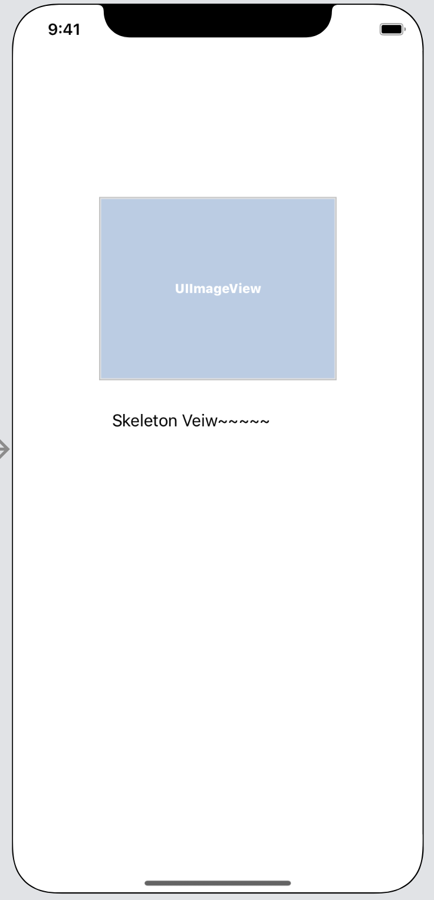
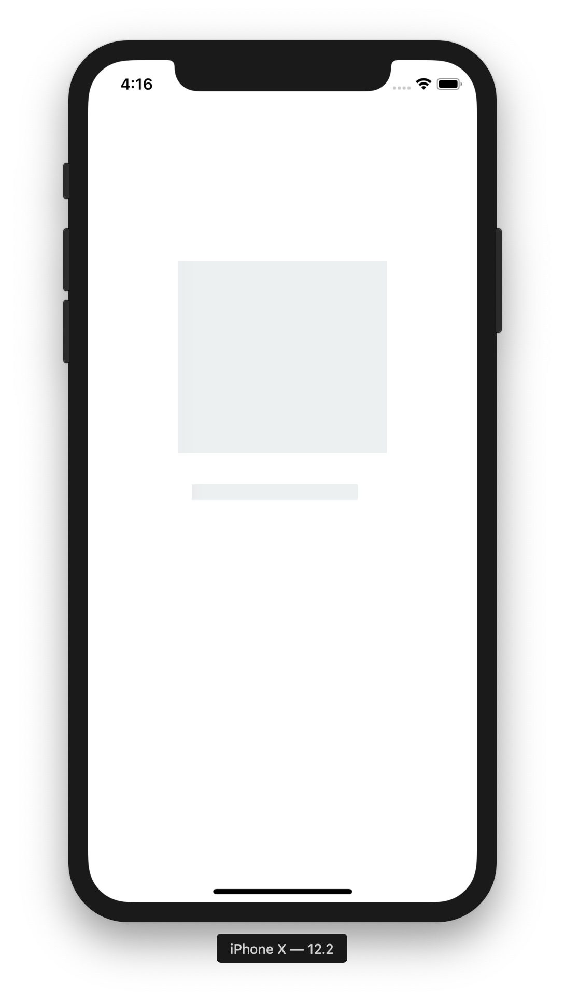

# SkeletonView 


### ☠️ SkeletonView 가 뭐야?

서버에서 데이터를 가져와서 view 에 보여주기 전까지 gradient anmation을 이용해 로딩중이라는 걸 user에게 알려주는 라이브러리로 요즘 이런 뷰 형태를 많이 띠고 있는 웹사이트나 모바일 앱이 많습니다.

예를들어 페이스북이나 유튜브도 이런 스타일로 첫 화면이 로딩되요.


<br/>

<br/>

SkeletonView를 사용하기 위해선 우선 코코아팟을 설치해야 해요.

<br/><br/>

### CocoaPods 설치 

``` 
$ sudo gem install cocoapods
```

<br/>

<br/>

코코아팟 라이브러리를 적용할 프로젝트로 이동한 후에

```
$ pod init
$ vi Podfile 

pod 'SkeletonView' 추가 
```


<br/><br/>

```
$ pod install
```

<br/>

이제 엑스코드 프로젝트를 열고 storyboard에서 다음과 같이 화면을 구성해 줍니다. 





 

***


<br/>

이미지뷰를 선택하고 Attributes inspector 보면 아래와 같이 View에 Is Skeletonable 이라는게 생겼을 거에요.

이걸 On으로 해서 적용해 줍니다.

<br/>

<br/>


<br/>

<br/>물론, 코드로도 적용 가능해요.

```
imageView.isSkeletonable = true
```

<br/><br/>

그리고 VC 으로 가서 `import SkeletonView` 한 후에

ViewDidLoad() 에서 

view에 4가지 타입의 skeleton을 선택해서 적용할 수있어요

저는  showAnimatedGradientSkeleton() 을 했습니다.


|                            Solid                             |                           Gradient                           |                        Solid Animated                        |                      Gradient Animated                       |
| :----------------------------------------------------------: | :----------------------------------------------------------: | :----------------------------------------------------------: | :----------------------------------------------------------: |
|  |  |  |  |


```
(1) view.showSkeleton()                 // Solid
(2) view.showGradientSkeleton()         // Gradient
(3) view.showAnimatedSkeleton()         // Solid animated
(4) view.showAnimatedGradientSkeleton() // Gradient animated
```


<br/><br/>




***


<br/>

<br/>

<br/>

### 참고 링크

[Juanpe SkeletonView](https://github.com/Juanpe/SkeletonView)